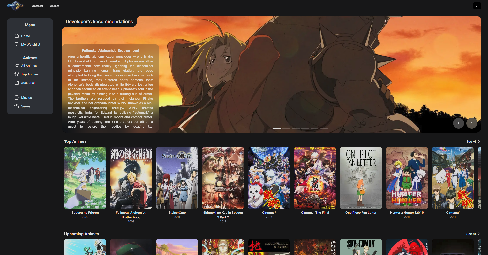
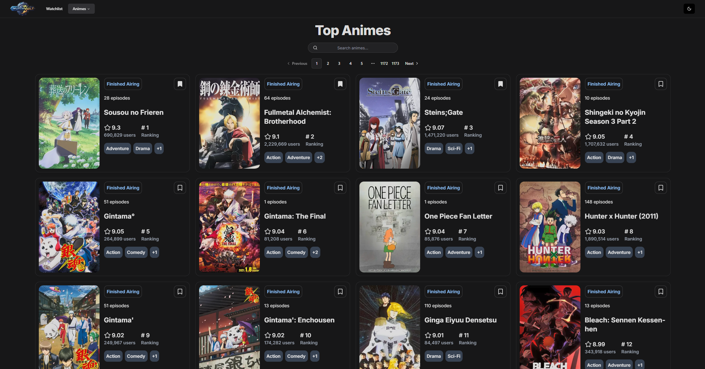
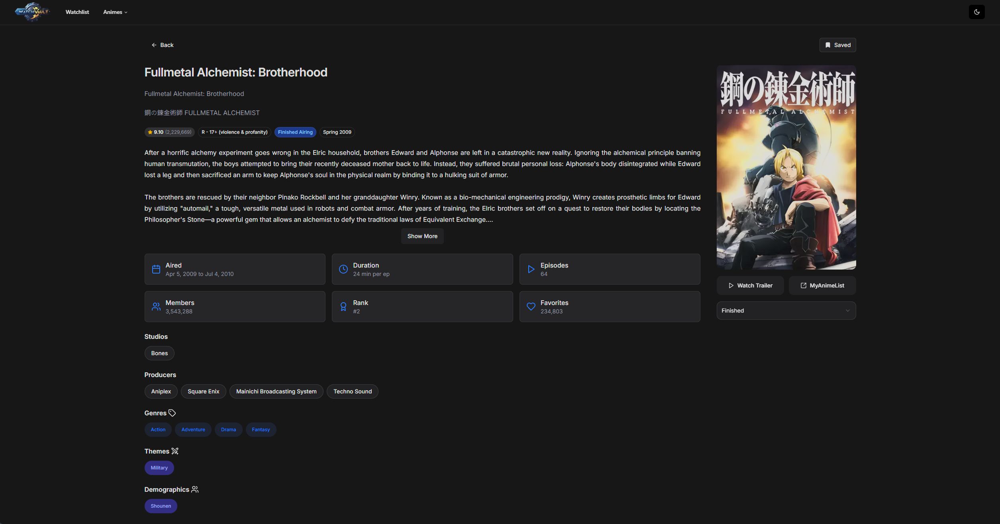
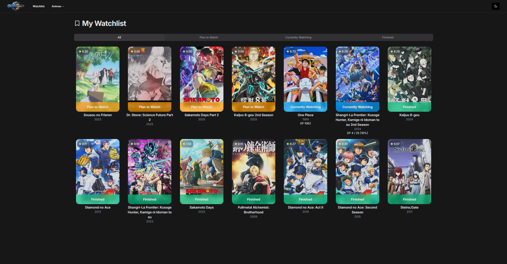

# Watch Vault

### [Live Demo] https://watch-vault-olive.vercel.app/

A personal web app to track your anime watching progress, powered by [Jikan API](https://jikan.moe/). Save your favorite anime, update your watch status, and never lose track of episodes again (especially useful for long-running series like One Piece!).

<div style="display: flex; flex-wrap: wrap; gap: 10px; justify-content: center;">
  
  
  
  
</div>

## Features

- 🔍 Search anime using the [Jikan API](https://jikan.moe/)
- 💾 Save anime to your personal watchlist
- 📊 Track progress (current episode, status: Plan to Watch/Currently Watching/Finished)
- ⚡ Fast and responsive UI with cached queries
- 📱 Mobile-friendly design

## 🔧 Tech Stack

| Layer                   | Technology             |
| ----------------------- | ---------------------- |
| Backend                 | Go (1.24+)             |
| Frontend                | Next.js 15 (React 19+) |
| Database                | Firebase               |
| UI Kit                  | ShadCN UI              |
| Data Sync               | TanStack React Query   |
| Anime API (Third Party) | Jikan                  |

## Project Purpose

This is a personal project built to:

- Improve my Go programming skills
- Learn modern frontend patterns with Next.js
- Solve my own problem of forgetting anime progress
- Experiment with full-stack development

## 🗂 Project Structure

```bash
project-root/
├── backend/ # Go backend (API, DB models, etc.)
├── frontend/ # Next.js frontend app
└── README.md
```

## 🚀 Getting Started

### 1. Clone the Repo

```bash
git clone https://github.com/your-username/your-repo-name.git
cd your-repo-name
```

### 2. Setup the Backend (Go)

```bash
cd backend
go mod tidy
```

### 3. Setup .env (Backend)

```bash
DEBUG=true # if local
FIREBASE_SERVICE_ACCOUNT_JSON= # Your Firestore credentials json file path (relative)
```

### 4. Setup the Frontend (Next.js)

```bash
cd ../frontend
yarn
```

### 5. Start the app (at root folder, run)

```bash
./start.sh
```

## Future Improvements

### Core Enhancements

**🏗️ Simplified Local Setup**

- Add SQLite support as a lightweight alternative to Firebase
- Docker configuration for easier dependency management

### User Features

**🔐 User Authentication**

- Implement Firebase email/password sign-in
- Optional OAuth providers (GitHub, Google)

**⭐ Personal Rating System**

- Custom 5-star ratings independent of [MyAnimeList](https://myanimelist.net/) scores
- Private user notes per anime entry

### Social Integration

**👥 Community Features**

- Friend system and shared watchlists
- Synchronized watching sessions
- Anime-specific discussion threads

## 🙌 Acknowledgements

- [Go](https://go.dev/)
- [Next.js](https://nextjs.org/)
- [TanStack Query](https://tanstack.com/query)
- [ShadCN UI](https://ui.shadcn.com/)
- [Firebase](https://firebase.google.com/)
- [Jikan API](https://jikan.moe/)
